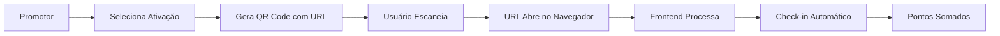

# 📚 Documentação das APIs - Sistema de Check-in com QR Codes Otimizado

## 🚀 Visão Geral

Sistema de check-in com QR Codes contendo URLs funcionais, otimizado para UX superior. Os QR Codes geram URLs que abrem automaticamente no navegador, permitindo check-in sem necessidade de app específico. **Sistema 100% baseado em GraphQL** com queries e mutations especializadas.

## 🔗 APIs GraphQL Disponíveis

### 1. **Gerar QR Code para Ativação**
**Mutation:** `gerarQRCodeAtivacao`

Gera um QR Code contendo URL funcional para uma ativação específica. O QR Code pode ser escaneado com qualquer câmera e abrirá automaticamente no webapp.

**Mutation:**
```graphql
mutation GerarQRCode {
  gerarQRCodeAtivacao(ativacaoId: "507f1f77bcf86cd799439011") {
    success
    message
    qrCodeDataURL
  }
}
```

**Resposta de Sucesso:**
```json
{
  "data": {
    "gerarQRCodeAtivacao": {
      "success": true,
      "message": "QR Code gerado com sucesso",
      "qrCodeDataURL": "data:image/png;base64,iVBORw0KGgoAAAANSUhEUgAA..."
    }
  }
}
```

**QR Code contém URL:**
```
https://seuapp.com/checkin?qrUUID=qr_1701234567890_abc123&uuid=abc123-def456&ativacaoId=507f1f77bcf86cd799439011&tipo=ativacao_checkin&timestamp=1701234567890
```

**Parâmetros:**
- `ativacaoId`: ID da ativação (obrigatório)

**Validações:**
- Usuário deve estar autenticado
- Ativação deve existir no banco de dados
- Ativação deve estar ativa

---

### 2. **Realizar Check-in via QR Code**
**Mutation:** `escanearQRCode`

Processa dados do QR Code escaneado (URL) e realiza o check-in do usuário. Extrai automaticamente UUID, ativacaoId e outros dados da URL.

**Mutation:**
```graphql
mutation EscanearQRCode {
  escanearQRCode(
    qrCodeData: "https://app.com/checkin?uuid=abc123-def456&ativacaoId=507f1f77&tipo=ativacao_checkin&timestamp=1701234567890"
    local: "Auditório Principal"
  ) {
    success
    message
    checkIn {
      id
      pontosGanhos
      createdAt
    }
    pontuacaoTotal
    ativacao {
      id
      nome
      pontuacao
    }
  }
}
```

**Resposta de Sucesso:**
```json
{
  "data": {
    "escanearQRCode": {
  "success": true,
      "message": "Check-in realizado com sucesso! Você ganhou 50 pontos.",
  "checkIn": {
        "id": "cl9ec1hxk00bt2w01wh9vsn4l",
        "pontosGanhos": 50,
        "createdAt": "2024-01-15T10:30:00.000Z"
      },
      "pontuacaoTotal": 150,
      "ativacao": {
        "id": "507f1f77bcf86cd799439011",
        "nome": "Palestra sobre IA",
        "pontuacao": 50
      }
    }
  }
}
```

**Parâmetros:**
- `qrCodeData`: URL completa extraída do QR Code (obrigatório)
- `local`: Local onde o check-in foi realizado (opcional)

**Validações:**
- Usuário deve estar autenticado
- URL deve ter formato válido com parâmetros corretos
- Ativação deve existir e estar ativa
- Tipo deve ser 'ativacao_checkin'
- Usuário não pode fazer check-in duplicado na mesma ativação

---

### 3. **Buscar Histórico de Check-ins**
**Query:** `meuHistoricoCheckins`

Retorna o histórico completo de check-ins do usuário autenticado.

**Query:**
```graphql
query MeuHistorico {
  meuHistoricoCheckins {
    id
    pontosGanhos
    local
    createdAt
    ativacao {
      nome
      evento {
        evento
      }
    }
  }
}
```

**Resposta de Sucesso:**
```json
{
  "data": {
    "meuHistoricoCheckins": [
      {
        "id": "cl9ec1hxk00bt2w01wh9vsn4l",
        "pontosGanhos": 50,
        "local": "Auditório Principal",
        "createdAt": "2024-01-15T10:30:00.000Z",
        "ativacao": {
          "nome": "Palestra sobre IA",
          "evento": {
            "evento": "Congresso de Tecnologia 2024"
          }
        }
      }
    ]
  }
}
```

**Validações:**
- Usuário deve estar autenticado
- Retorna apenas check-ins do usuário logado

---

### 4. **Buscar Ativação por UUID**
**Query:** `buscarAtivacaoPorUuid`

Busca informações de uma ativação pelo UUID, útil para validar QR Codes.

**Query:**
```graphql
query BuscarAtivacao {
  buscarAtivacaoPorUuid(uuid: "abc123-def456-789ghi-012jkl") {
    success
    message
    ativacao
    jaFezCheckin
  }
}
```

**Resposta de Sucesso:**
```json
{
  "data": {
    "buscarAtivacaoPorUuid": {
      "success": true,
      "message": "Ativação encontrada",
      "ativacao": {
        "id": "507f1f77bcf86cd799439011",
        "nome": "Palestra sobre IA",
        "pontuacao": 50,
        "ativa": "ativa"
      },
      "jaFezCheckin": false
    }
  }
}
```

**Parâmetros:**
- `uuid`: UUID da ativação (obrigatório)

**Validações:**
- Ativação deve existir
- Se usuário estiver autenticado, verifica se já fez check-in

---

## 🎯 Estrutura dos Dados no QR Code

### Parâmetros da URL
Cada QR Code contém uma URL com os seguintes parâmetros:

| Parâmetro | Tipo | Descrição | Obrigatório |
|-----------|------|-----------|-------------|
| `qrUUID` | string | **UUID único do QR Code** (validação principal) | ✅ |
| `uuid` | string | UUID único da ativação (compatibilidade) | ✅ |
| `ativacaoId` | string | ID da ativação no banco | ✅ |
| `tipo` | string | Sempre 'ativacao_checkin' | ✅ |
| `timestamp` | number | Momento da geração do QR Code | ✅ |

### Exemplo de URL
```
https://seuapp.com/checkin?qrUUID=qr_1701234567890_abc123&uuid=abc123-def456&ativacaoId=507f1f77bcf86cd799439011&tipo=ativacao_checkin&timestamp=1701234567890
```

### Fluxo de Dados
1. **Promotor:** Seleciona ativação → Gera QR Code
2. **Sistema:** Monta URL com dados da ativação
3. **QR Code:** Contém URL funcional (não JSON bruto)
4. **Usuário:** Escaneia → URL abre no navegador
5. **Frontend:** Extrai parâmetros → Chama `escanearQRCode`
6. **Backend:** Valida → Processa check-in → Retorna resultado

---

## 🔒 Segurança e Validações

- **Autenticação obrigatória**: Todas as mutations requerem usuário autenticado
- **Validação de tipo**: QR Code deve ter tipo 'ativacao_checkin'
- **Validação de ativação**: Ativação deve existir e estar ativa
- **Prevenção de duplicação**: Usuário não pode fazer check-in duplicado na mesma ativação
- **Validação de UUID**: UUID deve existir no banco de dados
- **⚠️ QR Code dinâmico**: QR Codes expiram em 5 minutos para evitar fraudes
- **🚨 Anti-fraude**: Previne uso de fotos de QR Codes antigos
- **Timestamp de controle**: QR Code inclui timestamp para validação de expiração
- **URLs funcionais**: QR Codes contêm URLs válidas (não dados brutos)

### Validação Anti-Fraude Baseada em UUID

Para evitar fraudes com fotos de QR Codes, implementamos um sistema avançado baseado em **UUID único por QR Code**:

**Sistema de Cache de UUIDs Válidos:**
```typescript
// Cache em memória (produção: Redis)
const qrCodeValidUUIDs = new Map<string, { ativacaoId: string; createdAt: number }>()

// Geração de UUID único para cada QR Code
function gerarQRCodeUUID(): string {
    return `qr_${Date.now()}_${Math.random().toString(36).substring(2, 9)}`
}
```

**Fluxo de Validação:**
1. **Geração:** Cria UUID único → Armazena no cache com expiração
2. **Validação:** Consulta cache → Verifica se existe e não expirou  
3. **Uso:** Check-in bem-sucedido → **Remove UUID do cache** (uso único)

**Vantagens sobre validação por timestamp:**
- ✅ **Controle preciso:** UUID válido apenas enquanto está no cache
- ✅ **Uso único:** UUID invalidado após check-in bem-sucedido
- ✅ **Sem sincronização:** Não depende de horário sincronizado
- ✅ **Escalável:** Fácil migração para Redis em produção
- ✅ **Auto-limpante:** UUIDs expirados são removidos automaticamente

**Validação Principal:**
```typescript
function validarQRCodeUUID(qrUUID: string): { valido: boolean; ativacaoId?: string } {
    const qrData = qrCodeValidUUIDs.get(qrUUID)
    
    if (!qrData) return { valido: false }
    
    // Verifica expiração e remove se necessário
    if (validarQRCodeExpirado(qrData.createdAt)) {
        qrCodeValidUUIDs.delete(qrUUID)
        return { valido: false }
    }
    
    return { valido: true, ativacaoId: qrData.ativacaoId }
}
```

**Mensagens de erro:**
```json
{
  "success": false,
  "message": "QR Code inválido ou expirado. Solicite um novo ao promotor."
}
```

---

## 🎯 Vantagens da Nova Arquitetura

### ✅ UX Superior
- **Zero Friction**: Usuário escaneia e URL abre automaticamente
- **Compatibilidade Universal**: Funciona com qualquer leitor de QR Code
- **Sem Apps Específicos**: Funciona direto no navegador
- **Processo Automático**: Check-in processado sem intervenção manual

### ✅ Tecnologia Otimizada  
- **URLs Funcionais**: QR Code contém URL completa (não JSON bruto)
- **Dados Completos**: UUID + ID da ativação para máxima flexibilidade
- **GraphQL Puro**: APIs especializadas e otimizadas
- **Código Limpo**: Removido código redundante e não utilizado

### ✅ Performance e Segurança
- **Busca Otimizada**: ID da ativação permite consulta direta
- **Validação Robusta**: Múltiplas camadas de validação
- **Auditoria Completa**: Timestamp e dados completos para rastreamento
- **Controle Total**: Admin controla pontos via ativações

---

## 📱 Fluxo Completo Atualizado



**Principais Mudanças:**
1. **QR Code → URL**: Não mais JSON bruto
2. **UX Otimizada**: Funciona com qualquer câmera
3. **Processo Automático**: Zero intervenção manual
4. **Dados Completos**: UUID + ID + timestamp
5. **Código Limpo**: Removido tudo que não é usado

---

## 🛠️ Configuração Necessária

### Variáveis de Ambiente
```bash
WEBAPP_URL=https://seuapp.com  # URL base para QR Codes
QR_CODE_EXPIRATION_MINUTES=5   # Tempo de expiração em minutos (opcional)
```

### Cache de UUIDs
**Desenvolvimento:** Map em memória (implementado)
**Produção:** Redis recomendado
```javascript
// Migração para Redis (exemplo)
const redis = require('redis')
const client = redis.createClient()

// Armazenar UUID válido
await client.setex(`qr:${qrUUID}`, 300, JSON.stringify({ ativacaoId, createdAt }))

// Validar UUID
const data = await client.get(`qr:${qrUUID}`)
```

### Frontend
Deve ter rota `/checkin` que:
1. Extrai parâmetros da URL
2. Chama `escanearQRCode` automaticamente
3. Processa resposta e mostra resultado ao usuário

### Exemplo JavaScript
```javascript
// Extrair dados da URL
const params = new URLSearchParams(window.location.search)
const qrCodeData = window.location.href

// Processar check-in
const response = await client.request(gql`
  mutation {
    escanearQRCode(qrCodeData: "${qrCodeData}") {
      success
      message
      pontuacaoTotal
    }
  }
`)
```

**Sistema otimizado para máxima UX e performance!** 🚀

